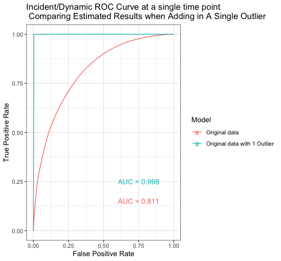

```{r setup, include=FALSE}
knitr::opts_chunk$set(echo = F)

set.seed(818)
library(here)
library(tidyverse)
library(ggplot2)
library(ggpubr)
library(kableExtra)

```


# Introduction

Time-dependent AUC and concordance are commonly used criteria for evaluating the discriminative performance of time-to-event models. These criteria are used in practice for both variable/model selection and comparing the performance of various models across studies. It has been shown that Concordance ($C$), a global measure of discrimination, is a weighted average of time-varying incident/dynamic AUC ($\text{AUC}^{\mathbb{I}/\mathbb{D}}(t)$) (Heagerty and Zheng, 2005). Several commonly used estimators of both $\text{AUC}^{\mathbb{I}/\mathbb{D}}(t)$ and $C$ suffer from a previously unidentified shortcoming which renders them fundamentally unsuitable for assessing out-of-sample discrimination (e.g. cross-validation, test-train-validation). Specifically, there is a potential for out-of-sample discrimination to be **vastly overestimated**, an issue that is very rarely seen in practice. Bringing attention to this issue and proposing an alternative framework is crucial for applied work. Correspondingly, the goals of the current work are to: 

1. Highlight and show via a comprehensive simulation study that certain classes of estimators of $\text{AUC}^{\mathbb{I}/\mathbb{D}}(t)$ and $C$ are unsuitable for assessing out-of-sample discrimination

2. Propose a set of estimators of $\text{AUC}^{\mathbb{I}/\mathbb{D}}(t)$ and $C$  suitable for out-of-sample discrimination and develop a corresponding inferential framework 

Briefly, both $\text{AUC}^{\mathbb{I}/\mathbb{D}}(t)$ and $C$ use observed event/censoring times ($T_i, \delta_i$) and estimates of risk ($\eta_i(t)$) obtained from, for example, Cox regression, to determine whether individuals with higher estimated risk tend to have earlier event times. The issue with certain estimators of $\text{AUC}^{\mathbb{I}/\mathbb{D}}(t)$ and $C$ is that the presence of outlying estimated risk ($\eta_i(t)$) can result in massive, unjustified shifts in estimated discrimination. To illustrate the magnitude of this issue, the Figure below plots an ROC curve for $\text{AUC}^{\mathbb{I}/\mathbb{D}}(t)$ created using the Heagerty \& Zheng (2005) estimator on simulated data, estimating prediction performance using $\text{AUC}^{\mathbb{I}/\mathbb{D}}(t)$ on $N=500$ participants. The two data sets (red line versus blue line ) differ in only one extreme outlier in covariates. The inclusion of one outlier participant's data shifts estimated AUC from $\approx 0.81$ to $\approx 1$, which is clearly implausible in the context of $500$ other data points.

```{r, echo=FALSE, fig.align = 'center', out.width='500px', out.height='400px'}

```

Estimates of $C$ based on these quantities are thus similarly affected.

We have identified the underlying issue that's driving this phenomena. Specifically, this phenomena is the result of the inclusion of terms of the form $e^{\eta_i}$ in the denominator and/or numerator of the estimators (in the case of $\text{AUC}^{\mathbb{I}/\mathbb{D}}(t)$, in the estimator for true positive rate). Estimators of this form are semi-parametric and have the benefit of creating a relatively smooth estimates of $\text{AUC}^{\mathbb{I}/\mathbb{D}}(t)$ over time ($t$). Fully non-parametric estimators of $\text{AUC}^{\mathbb{I}/\mathbb{D}}(t)$ and $C$ do not suffer from this issue. However, because we generally observe only one event at a particular time, the non-parametric estimators for $\text{AUC}^{\mathbb{I}/\mathbb{D}}(t)$ are highly variable (not smooth). Therefore, we propose that:

* For estimating $\text{AUC}^{\mathbb{I}/\mathbb{D}}(t)$, smoothed versions of non-parametric estimators for $\text{AUC}^{\mathbb{I}/\mathbb{D}}(t)$ be used in practice.

* For estimating $C$, fully non-parametric estimators or weighted averages of smoothed versions of non-parametric estimators for $\text{AUC}^{\mathbb{I}/\mathbb{D}}(t)$ be used in practice.

Below, we 1) present a brief description of various semi- and non-parametric estimators of $\text{AUC}^{\mathbb{I}/\mathbb{D}}(t)$ and $C$; and 2) provide a short simulation study (which will be expanded on in a manuscript) illustrating the issue with semi-parametric estimators of discrimination. 

# Method

Here, we discuss the estimands ($\text{AUC}^{\mathbb{I}/\mathbb{D}}(t)$, $C$) and their various semi- and non-paramteric estimators. First, we introduce some necessary notation and background. 

Let $i = 1,\ldots, N$ denote individual. Suppose we are interested in a time-to-event random variable, $T_i^*$, which is subject to right censoring. For each individual we observe $[T_i, \delta_i, \boldsymbol{X}_i^t]$ where $T_i = \text{min}(T_i^*, C_i)$ is the observed time (minimum of censoring time $C_i$ and true event time), $\delta_i = 1(T_i^* < C_i)$ is the event indicator, and  $\boldsymbol{X}_i \in \mathbb{R}^p$ is a vector of time-fixed covariates. The observed data are then $[\{T_i, \delta_i, \boldsymbol{X}_i \}, i = 1,\ldots, N]$.

For simplicity of presentation, we assume (conditionally) independent censoring and the data are generated by Cox proportional hazards model. Specifically, we assume the (conditional) distribution of event times is specified by a linear combination of a (log) baseline hazard and the covariate vector $\boldsymbol{X}_i$. Mathematically, we have

$$\begin{align*}
\log \lambda_i(t|\boldsymbol{X}_i) &= \log \lambda_0(t) + \boldsymbol{X}_i^t \boldsymbol{\beta}\;, \hspace{0.5cm} t > 0 \\
&= \log\lambda_0(t) + \eta_i
\end{align*}$$

where $\log \lambda_i(t|\boldsymbol{X}_i)$ is the conditional log-hazard for subject $i$ given their covariate vector $\boldsymbol{X}_i$, $\log \lambda_0(t)$ is the log baseline hazard, and $\boldsymbol{\beta}$ is a vector indicating the linear  contribution of each element of $\boldsymbol{X}_i$ to the log hazard.

## Estimands

### Incident/Dynamic AUC


The first estimand we discuss is Incident/Dynamic AUC. Let $S(t)$ be the marginal survival function of event times (not conditional on covariates) and $f(t)$ is the corresponding density function. At a fixed time point $t$ and a specific threshold for risk score $c$, $\text{AUC}^{\mathbb{I}/\mathbb{D}}(t)$ itself is defined by incident sensitivity and dynamic specificity defined as follows:

$$\begin{align*}
    \text{sensitivity}^{\mathbb{I}}(c,t) = & \text{TP}_t^{\mathbb{I}}(c) = \text{Pr}(\eta_i > c|T_i^* = t) \\
    1-\text{specificity}^{\mathbb{D}}(c,t) = & \text{FP}_t^{\mathbb{D}}(c) = 1-\text{Pr}(\eta_i \leq c|T_i^* > t) \\
\end{align*}$$

from which one can defined an incident/dynamic receiver operator characteristic (ROC) curve (p denotes a dynamic value of FP):

$$\begin{align*}
    \text{ROC}_t^{\mathbb{I}/\mathbb{D}}(p) =  \text{TP}_t^{\mathbb{I}}\{[\text{FP}_t^{\mathbb{D}}]^{-1}(p)\}
\end{align*}$$

Consequently I/D AUC:

$$\begin{align*}
    \text{AUC}^{\mathbb{I}/\mathbb{D}}(t) &= \int_0^1 \text{ROC}_t^{\mathbb{I}/\mathbb{D}}(p)dp
\end{align*}$$

### Concordance

Concordance is a global summary of the discriminatory power of a biomarker (in our context, the subject-specific log-hazard) to discriminate between the ordering of event times. Specifically, the estimand of interest is:

$$\begin{align*}
C &= \text{Pr}(\eta_i < \eta_j| T_i^* > T_j^*)\;.
\end{align*}$$

In the context of administrative censoring (e.g. a study end date), $C$ above is modified to

$$\begin{align*}
C^\tau &= \text{Pr}(\eta_i < \eta_j| T_i^* > T_j^*, T_j^* < \tau)\;,
\end{align*}$$

where $\tau$ is the **study end date**. Hereafter we will restrict our focus to $C^{\tau}$.

It is shown that concordance is a weighted average of time-varying AUC. Specifically, time-varying incident/dynamic AUC ($\text{AUC}^{\mathbb{I}/\mathbb{D}}(t)$). Formally, 

$$\begin{align*}
\text{C}^\tau &= \int_0^\tau\text{AUC}^{\mathbb{I}/\mathbb{D}}(t)w^{\tau}(t)dt\;,
\end{align*}$$

where 

$$\begin{align*}
w^{\tau}(t) &= 2f(t)S(t)/1-S^2(\tau)\;.
\end{align*}$$


## Estimators 

Here we discuss a number of estimators of $\text{AUC}^{\mathbb{I}/\mathbb{D}}(t)$ and $C^{\tau}$.

### Incident/dynamic AUC

Estimators of $\text{AUC}^{\mathbb{I}/\mathbb{D}}(t)$  evaluate incident sensitivity ($\text{Pr}(\eta_i > c | T_i^* = t)$) and dynamic specificity ($\text{Pr}(\eta_i \leq c | T_i ^*> t)$) at each unique value of the biomarker among those individuals still in the risk set at time $t$ ($\{\eta_i: T_i \geq t\}$). 

Of those methods considered here, all use a non-parametric estimator for dynamic specificity. In practice this works well as, for most $t$, there are a substantial number of individuals with $T_i > t$. The estimators of $\text{AUC}^{\mathbb{I}/\mathbb{D}}(t)$ differ in how they estimate incident sensitivity. Specifically, there is a semi-parametric estimator proposed by Heagerty and Zheng (2005) and a non-parametric estimator. We refer to these estimators of $\text{AUC}^{\mathbb{I}/\mathbb{D}}(t)$ as the "HZ" and "NP" estimators, respectively.

However, the non-parametric estimator of $\text{AUC}^{\mathbb{I}/\mathbb{D}}(t)$ turns out to be highly variable since in practice we generally observe only a few (or even a single) events at  a given $t$. Thus, we propose an additional non-paramteric estimator of $\text{AUC}^{\mathbb{I}/\mathbb{D}}(t)$ which is a smoothed version of the non-parametric estimator based on regression splines (referred to as "SNP" estimator). We describe the smoothed estimator in more detail below. 

**Estimator of dynamic specificity**: For a fixed threshold of risk score $c$, we estimate the false positive rate (1-incident specificity)  at time t as: 

$$\hat{\text{FP}}_t^{\mathbb{D}}(c) = \frac{\sum_{k}I(\eta_k>c)I(T_k>t)}{\sum_{j}I(T_j>t)}$$

**Estimators of incident sensitivity**: 

- Semi-parametric: 

$$\hat{\text{TP}_t}^{\mathbb{I}}(c)=\frac{\sum_{k}I(\eta_k>c)I(T_k\geq t)exp(\eta_k)}{\sum_{j}I(T_j\geq t)exp(\eta_j)}$$

The formula above helps us understand why an extreme outlier can cause significant overestimation of out-of-sample $\text{AUC}^{\mathbb{I}/\mathbb{D}}(t)$. Specifically, the term $exp(\eta_k)$ would be very large for the outlying observation, driving its weight $\frac{exp(\eta_k)}{\sum_{j}I(T_j\geq t)exp(\eta_j)}$ close to 1. Therefore, the semi-parametric true positive rate is overestimated because the importance of this outlier is unreasonably inflated. 


- Non-parametric: The non-parametric estimator of incident sensitivity is presented below. Note that because there are relatively few inidividuals with $T_i = t$ for a given $t$, this estimator is highly variable.

$$\hat{\text{TP}_t}^{\mathbb{I}}(c) = \frac{\sum_{k}I(\eta_k>c)I(T_k=t)I(\delta_k=1)}{\sum_{j}I(T_j=t)I(\delta_j=1)}$$

At each unique observed event time $t$, we have estimates of $\hat{\text{TP}_t}^{\mathbb{I}}(c)$ and $\hat{\text{FP}_t}^{\mathbb{D}}(c)$ at each unique biomarker value $c$. From these we obtain $\hat{\text{AUC}}^{\mathbb{I}/\mathbb{D}}(t)$ by integrating the corresponding ROC curve numerically. For the non-parametric estimator, we then smooth the $\hat{\text{AUC}}^{\mathbb{I}/\mathbb{D}}(t)$ across time using penalized splines to create the "smoothed non-parametric estimator" of $\hat{\text{AUC}}^{\mathbb{I}/\mathbb{D}}(t)$.

### Concordance

1. Integrated estimated $\text{AUC}^{\mathbb{I}/\mathbb{D}}(t)$:

$$\begin{align*}
\text{C}^\tau &= \int_0^\tau\hat{\text{AUC}}^{\mathbb{I}/\mathbb{D}}(t)\hat{w}^{\tau}(t)dt\;,
\end{align*}$$

recall that estimating $w^{\tau}(t)$ requires estimates of $S(t)$ and $f(t)$. So, this estimator of concordance requires estimates for $\text{AUC}^{\mathbb{I}/\mathbb{D}}(t)$, $S(t)$, and $f(t)$. These quantities are evaluated at each observed event time, and then integrated numerically using, for example, the trapezoidal rule. There are various approaches for estimating each of these quantities. For simplicity of presentation we will defer the details on estimating $f(t)$ and $S(t)$ to the manuscript and focus here on estimators of $\text{AUC}^{\mathbb{I}/\mathbb{D}}(t)$. Specifically, we consider two estimators of $\text{AUC}^{\mathbb{I}/\mathbb{D}}(t)$, a semi-paramtric estimator (HZ) and a non-parametric estimator, which are discussed in the previous section. 

2. Gonen & Heller (2005):

$$C = \frac{2}{n(n-1)}\sum_{i<j}{\frac{I(\eta_j-\eta_i<0)}{1+exp(\eta_j-\eta_i)}+\frac{I(\eta_i-\eta_j<0)}{1+exp(\eta_i-\eta_j)}}$$

In addition to observed quantities, the Gonen & Heller estimator of Concordance requires only estimates of risk ($\eta_i$). Note that the Gonen & Heller estimator has terms of the form $e^{\eta}$ in the denominator.

3. Harrell's C-index (1982, 1984):

$$C = \frac{\sum_{i<j}I(T_i<T_j)I(\eta_i>\eta_j)I(\delta_i=1)+I(T_i>T_j)I(\eta_i<\eta_j)I(\delta_j=1)}{\sum_{i<j}I(T_i<T_j)I(\delta_i=1)+I(T_i>T_j)I(\delta_j=1)}$$

In addition to observed quantities, the Harrell's estimator of Concordance requires only estimates of risk ($\eta_i$) and is fully non-parametric.

# Results

## Simulation set up

The simulation study presented here is designed to illustrate the undesirable properties of semi-parametric estimators of both $\text{AUC}^{\mathbb{I}/\mathbb{D}}(t)$ and $C$. 

For each of the 1000 simulated data sets with sample size N = 500, we generated three covariates $\boldsymbol{X} = (X_1, X_2, X_3)$ independently from standard normal distribution and set the true value of coefficients to be (1, -1, 0.25). Therefore, the risk score $\eta = \boldsymbol{X^t\beta}$ follows a normal distribution with mean = 0 and variance of 2.0625. The survival time $T$ is generated from a propotional hazard model with Weibull baseline hazard $\lambda_0(t) = p\theta t^{p-1}$, thus the baseline survival function $S_0(t) = exp(-\theta t^p)$, and survival function conditioning on covariates is $logS(t|\boldsymbol{X}) = exp(\boldsymbol{X^t\beta})logS_0(t)$. In addition, the censor time is generated independently from survival time and uniformly between (0.5, 1). 

To investigate the effect of noise on estimators, we constructed three different models: 1) model correctly specified with the three covariates; 2) model with 20 additional noise signals, generated identically and independently with covariates; and 3) model with 100 additional noise signals. The additional noise signals are not associated with outcome, thus should not contribute to the discriminative performance of underlying models. Therefore the true AUC and concordance values should not change across three models. 

We also introduce the following abbreviations for estimators:

```{r}
est_df <- data.frame(c("Semi-parametric", "Non-parametric", "Smoothed non-parametric"), 
                     c("HZ" , "NP", "SNP"), 
                     c("Kaplan-Meier curve", "Smoothed Kaplan-Meier curve", ""),
                     c("S", "SmS", ""))

colnames(est_df) <- c("Method", "Abberiviation", "Method", "Abberiviation")
est_df %>% kable(escape = F, align = "c") %>%
  kable_styling() %>%
  add_header_above(c("Incident/dynamic AUC estimator" = 2,
                     "Weight for integrating AUC" = 2))
```


## Preliminary results


```{r}
load(here("outputData/true_values.RData"))
# load(here("outputData/estimated_values.RData"))
load(here("outputData/estimates_N_250.RData"))
```


```{r}
# use interpolation to estimate true_auc
# interpolated_auc_train<-approx(x = true_auc_sort$time_bin, y = true_auc_sort$auc, 
#                          xout = auc_df_train$time)$y
# interpolated_auc_test<-approx(x = true_auc_sort$time_bin,
#                               y = true_auc_sort$auc, 
#                               xout = auc_df_test$time)$y

interpolated_auc_<-approx(x = true_auc_sort$time_bin,
                              y = true_auc_sort$auc,
                              xout = auc_df$time)

plot(interpolated_auc_$x, interpolated_auc_$y,
     main = "True AUC", xlab = "time", ylab = "")

auc_df$true <- interpolated_auc_$y
# some more cleaning

```


The properties of estimators are summarized in the two tables below. 

```{r}
compare_auc <- cbind(c("Semi-parametric", "Non-parametric", "Smoothed non-parametric"),
                          c("No bias", "Slight underetimation at the end", "Underestimation at edges but overestimation in the middle"),
                          c("Small", "Large", "Medium"),
                          c("Yes", "No", "No"))

colnames(compare_auc) <- c("Estimator", "Bias", "Variability", "Over-optimistic out-of-sample estimation") 
  
compare_auc %>% kable(escape = F, caption = "Summary of time-varying AUC estimators", align = "c") %>%
  kable_styling()
```

```{r}
compare_c <- data.frame(Estimator = c("Gonen-Heller", 
                                      "HZ_S","HZ_SmS",
                                      "Harrell's C", 
                                      "NP_S","NP_SmS",
                                      "SNP_S","SNP_SmS"))

compare_c[, 'Bias'] <- c(rep("No bias", 3), "Overestimation", "Overestimation", rep("No bias", 3))
compare_c[, 'Variability'] <- c(rep("Small", 4), "Large", rep("Small", 3))
compare_c[, 'Over-optimistic out-of-sample estimation'] <- c(rep("Yes", 3), rep("No", 5))

compare_c %>% kable(escape = F, caption = "Summary of concordance estimators", align = "c") %>%
  kable_styling() %>%
  group_rows(index = c("Semi-parametric" = 3, "Non-parametric" = 5))
```

Below we present more detailed results from simulation. For the purpose of better presentation, incident/dynamic AUC estimates across all simulation is smoothed over time with regression splines in the following figure, since the event times generated in each simulation are different. As is revealed, both semi- and non-parametric estimators are unbiased and close to the truth when the model is specified without noise, while smoothed non-parametric estimator seems to underestimate true discriminative performance at the beginning and end of follow-up period, but overestimate in the middle. However, as we include more noise signals in the model, both in-sample and out-of-sample semi-parametric estimates are significantly inflated to be much higher than the truth, and out-of-sample estimates are even higher than in-sample, indicating overestimation of the discriminative performance of underlying models.  

```{r format}
# AUC
auc_df$sample <- factor(auc_df$sample, levels = 1:2, 
                        labels = c("In-sample", "Out-of-sample"))
auc_df_long <- auc_df %>%
  pivot_longer(4:6, names_to = "Estimator", values_to = "AUC") %>%
  mutate(Estimator = factor(Estimator, 
                            levels = c("HZ", "SNP", "NP")),
         model = factor(model,
                        levels = c("No noise", "20 noise", "100 noise")))

# concordance
c_df$sample <- factor(c_df$sample, levels = 1:2, 
                        labels = c("In-sample", "Out-of-sample"))
c_df_long <- c_df %>% 
  pivot_longer(3:7, names_to = "Estimator", values_to = "Concordance" ) %>%
  mutate(Estimator = factor(Estimator,
                            levels = c("HZ","GH", "Harrell.s","NP","SNP"),
                            labels = c("HZ","GH", "Harrell","NP","SNP")),
          model = factor(model,
                        levels = c("No noise", "20 noise", "100 noise")),
         Type = ifelse(Estimator=="HZ"|Estimator=="GH", "Semi-parametrc", 
                       "Non-parametric"))
```

```{r tvauc_smooth, cache=TRUE, fig.height=3, fig.width=10}
auc_df_long %>%
  ggplot(aes(x = time, y = AUC, col = model, linetype = sample))+
  geom_smooth(se = F, formula = y~s(x, k=30, bs = "cs"), 
              na.rm = T, method = "gam")+
  geom_line(aes(x = time, y = true), na.rm = T, col = "black")+
  facet_grid(cols=vars(Estimator))+
  labs(x="time", y = "AUC")
```


```{r tvauc_boxplots, fig.height=9, fig.width=6}
brk <- seq(0, 1, 0.2)
auc_df_long %>%
  select(-true) %>%
  mutate(time_bin = cut(time, breaks = brk, include.lowest = T)) %>%
  ggplot(aes(x = factor(time_bin), y = AUC, fill = Estimator))+
  geom_boxplot(outlier.size = 0.5)+
  facet_grid(cols=vars(sample), rows = vars(model))+
  labs(x = "Time", y = "AUC")+
  theme(axis.text.x = element_text(angle = 60, vjust = 0.1, hjust = 0.1))
  #scale_x_discrete(breaks = as.factor(c(0.1, 0.3, 0.5, 0.7, 0.9)))

```


From the figure below, most estimators of concordance are unbiased when the model is specified correctly. However, the Harrell' c-index and concordance from integrating non-parametric $\text{AUC}^{\mathbb{I}/\mathbb{D}}(t)$ estimator with weights from estimated Kaplan-Meier curve (NP_S) is biased upwards. The non-parametric estimators are also more variable, but smoothing either the survival curve or estimates of $\text{AUC}^{\mathbb{I}/\mathbb{D}}(t)$ seems to significantly reduce both bias and variability (NP_SmS). It is also worth noting that the out-of-sample bias of Harrell's c and NP_S is smaller than in-sample bias. However, as more noise signals are included in the model, all the semi-parametric estimators (Gonen-Heller, HZ_S and HZ_SmS) are also significantly inflated above the truth, and the fully non-parametric estimators reveal overfit to the training data. 

```{r, fig.height=9, fig.width=6}
c_df_long %>% 
  ggplot(aes(x = Estimator, y = Concordance))+
  geom_boxplot(aes(fill = Type))+
  facet_grid(cols=vars(sample), rows = vars(model))+
  geom_hline(yintercept = true_c, col = "red")
```


# Discussion

We would like to further investigate how variable selection methods (e.g. ridge regression) would affect estimators of $\text{AUC}^{\mathbb{I}/\mathbb{D}}(t)$ and concordance. Since out-of-sample inflation was caused by model overfit to the training data, we anticipate using LASSO or ridge regression in model fit would mitigate this inflation. 

We would also attempt to mitigate bias of smoothed non-parametric estimator (SNP) of $\text{AUC}^{\mathbb{I}/\mathbb{D}}(t)$. One possible cause for bias is the distribution of $\text{AUC}^{\mathbb{I}/\mathbb{D}}(t)$, which seems to be bounded, skewed and inter-correlated. We have found so far that neither transformation of outcome nor weighted regression by variance was helpful, while use a bounded regression in smoothing (e.g. beta distribution) led to slight improvement. In addition, while non-parametric concordance seems to have upward bias, it is not clear why smoothness of survival function for weights or AUC estimates itself seems to reduce such bias. 

For the dissertation project, the content in this report will be organized and expanded in the first paper, focusing on comparison of estimator properties on both simulated and real data. Our current plan for the second paper is to focus on eliminating the bias of smoothed non-parametric estimator. We aim to develop non-parametric estimators of $\text{AUC}^{\mathbb{I}/\mathbb{D}}(t)$ and concordance that are unbiased, stable and with good asymptotic properties.

# Methedological contributions

In this work, we have identified and illustrated a shortcoming of existing semi-parametric estimators of model discrimination, which can be misleading for decision making in practice in may cases, such as model selection, prediction, etc. In addition, we have also attempted to propose alternative procedures for measure of discriminative performance. Specifically, we have introduced non-parametric estimators of $\text{AUC}^{\mathbb{I}/\mathbb{D}}(t)$, and concordance derived by integrating such estimates. However, such estimators can be highly variable in practice, which is not ideal for numeric integration. Therefore, we proposed "smoothed" estimation of either $\text{AUC}^{\mathbb{I}/\mathbb{D}}(t)$ or survival functions with penalized regression splines as follows: 

**For Incident/Dynamic AUC:**

$$\begin{align*}
\widehat{\text{AUC}}^{\mathbb{I}/\mathbb{D}}(t) &= 
    f_0(t) + \epsilon(t)\\
    &= \sum_{k=1}^K \xi_k B_k(t) + \epsilon(t)
    \end{align*}$$
Which is subject to a second derivative penalty of $f_0(t)$. The smoothed estimated $\tilde{\text{AUC}}^{\mathbb{I}/\mathbb{D}}(t) = \hat{f}_0(t)$.

We used the same strategy for smoothing survival function, but with the following additional constrains:

1. Montonicity constraints $S(t_1) > S(t_2)$ for $t_1 < t_2$

2. Point constraint $S(0) = 1$

3. Positivity $S(t) > 0$

We have also proposed a method for deriving true $\text{AUC}^{\mathbb{I}/\mathbb{D}}(t)$, and consequently concordance under this simulation setting. This problem is not trivial except for very simple cases. Here we propose a general solution:

Since we have generated data from proportional hazard model with a defined baseline hazard, we can write the conditional density of event time as $f(t| \eta) = \lambda(t|\eta)S(t|\eta) = \lambda_0(t)exp(\eta)S_0(t)^{exp(\eta)}$. Subsequently, we can derive the formulas for sensitivity (TP) and specificity (1-FP) based on Bayes' rule:

**Incident sensitivity:**

$$\begin{align*}
\text{Pr}(\eta_i > c|T_i = t) 
    &= E[1(\eta > c) | T = t] \\
    &= \int 1(\eta > c) f(\eta | t) d\eta \\
    &= \int 1(\eta > c) \frac{f(t|\eta)f(\eta)}{\int f(t|\eta) f(\eta)d\eta}d\eta
\end{align*}$$

**Dynamic specificity:**

$$\begin{align*}
    \text{Pr}(\eta_i \leq c|T_i > t) 
    &= \frac{\text{Pr}(\eta_i \leq c \cap T_i > t)}{\text{Pr}(T_i > t) } \\
    &= \frac{\int_t^\infty \int_{-\infty}^c f(t|\eta)f(\eta) d\eta dt }{\int_t^\infty [\int f(t|\eta)f(\eta)d\eta] dt} \\
\end{align*}$$

Therefore, we could plot out the ROC curve at a specific time point, and get $\text{AUC}^{\mathbb{I}/\mathbb{D}}(t)$ through integral over all possible thresholds of biomarker: 

$$\begin{align*}
        \text{AUC}^{\mathbb{I}/\mathbb{D}}(t)
            &= \int_0^1 \text{ROC}_t^{\mathbb{I}/\mathbb{D}}(p) dp \\
            &= \int_0^1\text{TP}_t^{\mathbb{I}}\{[\text{FP}_t^{\mathbb{D}}]^{-1}(p)\}dp \\
            &\approx \sum_l \delta_l \text{TP}_t^{\mathbb{I}}\{[\text{FP}_t^{\mathbb{D}}]^{-1}(l)\}
\end{align*}$$

Where $\delta_l$ is the quadrature weight. 

In practice, it is usually unrealistic to find closed-form solution for formulas above. Therefore, we have used numeric integration to calculate these quantities. It is a huge computational burden to evaluate $\text{AUC}^{\mathbb{I}/\mathbb{D}}(t)$ at all unique event times generated across all 1000 simulations. Therefore, we have evaluated the true value on 500 distinct time points that are equally spaced between 0 and 1 (which is the range of follow-up time in our simulation setting), and used interpolation to estimate values in between. 


# References

Heagerty, P. J., & Zheng, Y. (2005). Survival model predictive accuracy and ROC curves. Biometrics, 61(1), 92–105. https://doi.org/10.1111/j.0006-341X.2005.030814.x

Gönen, M., & Heller, G. (2005). Concordance Probability and Discriminatory Power in Proportional Hazards Regression. Biometrika, 92(4), 965–970. http://www.jstor.org/stable/20441249
